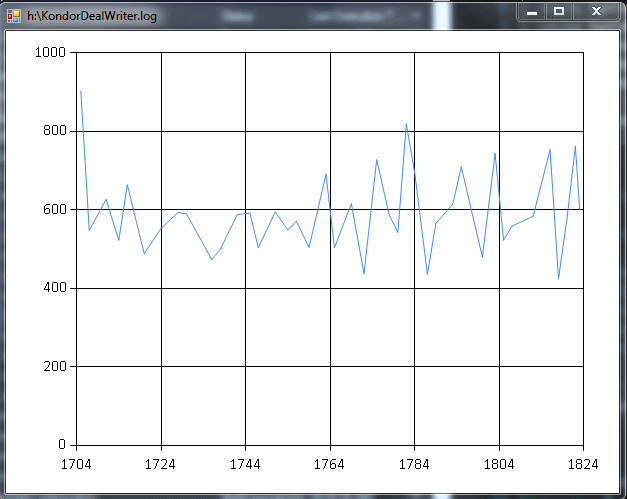

# LiveLogChart

Draw live chart based on data extracted from log file.

## Installation

    .paket\paket.bootstrapper.exe
    .paket\paket.exe install

## Usage

    fsi.exe .\LiveLogChart.fsx <pattern> <logFile>
    fsi.exe .\LiveLogChart.fsx "Elapsed processing time: (?<value>\d+)" c:\logs\application.log

